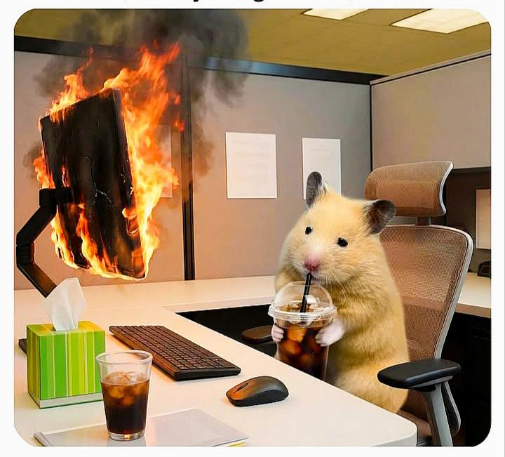

<div align="center">
  
</div>

<div align="center">
  
</div>


## 👨‍💻 About Me


Hi, I'm **Souvik Basu Roy**, a **1st year BCA student** at **Institute of Engineering & Management (IEM) Kolkata**.

I'm currently building my foundation in programming and exploring the world of software development through learning, practice, and projects.

### 🌱 Currently Learning
- **C & C++**
- **Python**
- **DSA**
- **OOP**

I believe in growing step by step — learning from every bug, every project, and every challenge along the way.

<br clear="right"/>

---


## 🛠️ Tech Stack & Tools

<div align="center">

### 💻 Languages
<p>
  
</p>

### 🗄️ Database
<p>
  
</p>

### ⚙️ Tools
<p>
  
</p>

</div>

---


## 😄 Current Coding Situation

<div align="center">
  
</div>

<div align="center">

> *Code pe darati....bugs chal aati 😵....*  
> *Main toh ainvayi ainvayi lutt gaya 🐹🔥*

</div>

---

## 🚀 The Developer Loop

```cpp
#include <iostream>
using namespace std;

int main() {
    bool success = false;

    while (!success) {
        learn();      // absorb everything
        build();      // turn ideas into reality
        debug();      // embrace the chaos
        repeat();     // never stop growing
    }

    return 0;  // someday... 😄
}
```

---

## 🌐 Let's Connect

<div align="center">
  <a href="https://github.com/souvikbasuroy" target="_blank">
    
  </a>
  <a href="https://www.linkedin.com/in/souvik-basu-roy" target="_blank">
    
  </a>
  <a href="mailto:souvikbasuroy1@gmail.com">
    
  </a>
  <a href="https://discord.com/users/1477341164708561040" target="_blank">
    
  </a>

  <a href="https://www.instagram.com/souvikbasuroy_?igsh=MWd6d3FwNGFyeDlzYw==" target="_blank">
    
  </a>
</div>

---

<div align="center">

